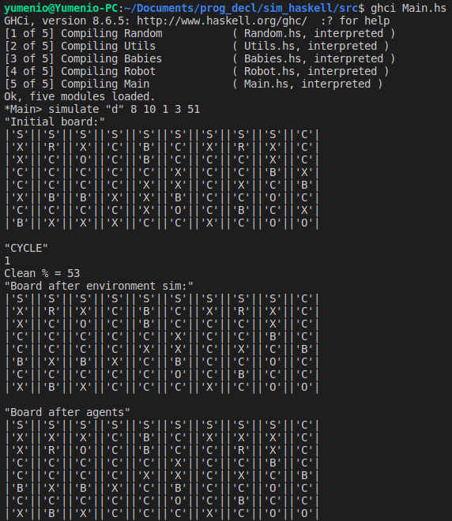
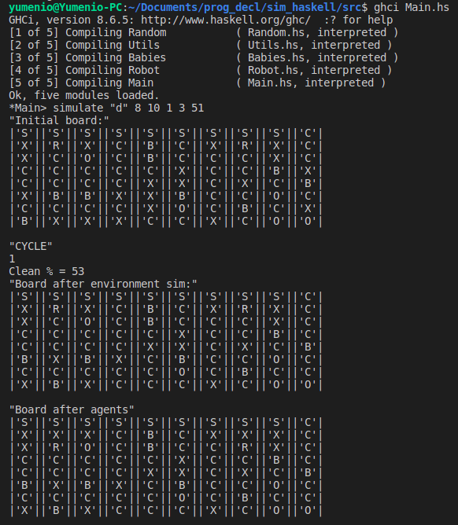

# Proyecto de Simulación y Programación Declarativa

#																						   Agentes

## 								Andy A. Castañeda Guerra C412

### Problema

​	El ambiente en el cual intervienen los agentes es discreto y tiene la forma de un rectángulo de N × M . El ambiente es de información completa, por tanto todos los agentes conocen toda la información sobre el agente. El ambiente puede
variar aleatoriamente cada t unidades de tiempo. El valor de t es conocido. Las acciones que realizan los agentes ocurren por turnos. En un turno, los agentes realizan sus acciones, una sola por cada agente, y modifican el medio sin que este varı́e a no ser que cambie por una acción de los agentes. En el siguiente, el ambiente puede variar. Si es el momento de cambio del ambiente,
ocurre primero el cambio natural del ambiente y luego la variación aleatoria. En una unidad de tiempo ocurren el turno del agente y el turno de cambio del ambiente.

​	Los elementos que pueden existir en el ambiente son obstáculos, suciedad, niños, el corral y los agentes que son llamados Robots de Casa. A continuación se precisan las caracterı́sticas de los elementos del ambiente:
**Obstáculos**: estos ocupan una única casilla en el ambiente. Ellos pueden ser movidos, empujándolos, por los niños, una única casilla. El Robot de Casa sin embargo no puede moverlo. No pueden ser movidos ninguna de las casillas ocupadas por cualquier otro elemento del ambiente.
**Suciedad**: la suciedad es por cada casilla del ambiente. Solo puede aparecer en casillas que previamente estuvieron vacı́as. Esta, o aparece en el estado inicial o es creada por los niños.
**Corral**: el corral ocupa casillas adyacentes en número igual al del total de niños presentes en el ambiente. El corral no puede moverse. En una casilla del corral solo puede coexistir un niño. En una casilla del corral, que esté vacı́a, puede entrar un robot. En una misma casilla del corral pueden coexistir un niño y un robot solo si el robot lo carga, o si acaba de dejar al niño.
**Niño**: los niños ocupan solo una casilla. Ellos en el turno del ambiente se mueven, si es posible (si la casilla no está ocupada: no tiene suciedad, no está el corral, no hay un Robot de Casa), y aleatoriamente (puede que no ocurra movimiento), a una de las casilla adyacentes. Si esa casilla está ocupada por un obstáculo este es empujado por el niño, si en la dirección hay más de un obstáculo, entonces se desplazan todos. Si el obstáculo está en una posición donde no puede ser empujado y el niño lo intenta, entonces el obstáculo no se mueve y el niño ocupa la misma posición. Los niños son los responsables de que aparezla suciedad. Si en una cuadrícula de 3 por 3 hay un solo niño, entonces, luego de que él se mueva aleatoriamente, una de las casillas de la cuadrı́cula anterior que esté vacı́a puede haber sido ensuciada. Si hay dos niños se pueden ensuciar hasta 3. Si hay tres niños o más pueden resultar sucias hasta 6. Los niños cuando están en una casilla del corral, ni se mueven ni ensucian. Si un niño es capturado por un Robot de Casa tampoco se mueve ni ensucia.
**Robot de Casa**: El Robot de Casa se encarga de limpiar y de controlar a los niños. El Robot se mueve a una de las casillas adyacentee, las que decida. Solo se mueve una casilla sino carga un niño. Si carga un niño pude moverse hasta dos casillas consecutivas. También puede realizar las acciones de limpiar y cargar niños. Si se mueve a una casilla con suciedad, en el próximo turno puede decidir limpiar o moverse. Si se mueve a una casilla donde está un niño, inmediatamente lo carga. En ese momento, coexisten en la casilla Robot y niño. Si se mueve a una casilla del corral que está vacı́a, y carga un niño, puede decidir si lo deja esta casilla o se sigue moviendo. El Robot puede dejar al niño que carga en cualquier casilla. En ese momento cesa el movimiento del Robot en el turno, y coexisten hasta el próximo turno, en la misma casilla, Robot y niño.

### Objetivos

El objetivo del Robot de Casa es mantener la casa limpia. Se considera la casa limpia si el 60 % de las casillas vacias no están sucias.

### Principales Ideas e Implementación

El problema planteado consiste en mantener un tablero libre de suciedad, el cual evoluciona con el tiempo. Una primera idea, bastante básica, para diseñar un robot que sea capaz de mantener la suciedad a raya, consiste en ir secuencialmente lidiando con los problemas más cercanos al robot. Esto es, buscar un camino válido que le permita llegar al robot a un niño para que lo cargue y posteriormente dejarlo en el corral, o la vía hasta la casilla llena de suciedad más cercana al robot en cuestión. Este agente sería un agente reactivo, con la particularidad de que, debido a especificaciones del problema, conoce todo el entorno, pero solamente tiene en cuenta aquellas "amenazas" más cercanas para deshacerse de ellas cuanto antes, consecutivamente.

Luego de pensar unos segundos, está claro que esta solución es sencilla, pero está lejos de ser óptima. El caso es que los niños suponen un problema muchísimo más grande que la simple suciedad, los niños son al final, la principal fuente de suciedad en el sistema, así que ocuparnos de ellos debería ser la prioridad, pero el agente descrito anteriormente ataca el problema más cercano, y en caso de tener una casilla sucia a la misma distancia que una casilla con un bebé, no discernirá entre sus opciones y lidiará con cualquiera de ellas, arbitrariamente. Una mejora a esto sería entonces primero deshacernos de los bebés, y una vez hecho esto preocuparnos por la suciedad restante, la cual ya no se incrementará al ritmo de antes. Y si pensamos un poco más allá, sería incluso mejor si elegimos la secuencia de pasos que "maximice" la cantidad de problemas con los que lidiamos. Es decir, si tenemos 3 caminos para llegar a un bebé, será mejor elegir aquel que tenga mas suciedad en su recorrido para limpiarla según nos acercamos. Para ello, a cada posible recorrido en el tablero le podemos asignar un costo, donde, movernos a una casilla vacía es lo peor(aunque muchas veces sea obligatorio para llegar al objetivo), utilizar casillas sucias es bueno, y llegar a casillas ocupadas por un bebé es evidentemente lo mejor. Para esto se puede hacer un recorrido en profundidad por el tablero hasta alcanzar un bebé, dándole a cada paso que damos un costo, mayor para movimientos infructuosos, mediano para casillas con basura, y el menor para el movimiento en el cual llegamos a un bebé. Finalmente, nos quedamos con el mejor de todos estos recorridos según los vamos descubriendo. Este ya sería un *goal-based agent*, donde las decisiones tomadas no son tan triviales como encargarse del problema más cercano, y se trabaja mucho más enfocado al objetivo planteado, que es mantener la casa tan limpia como sea posible.

La idea anterior parece perfecta en papel, pero en la práctica es fácil darse cuenta de cuan ineficiente resulta, pues si bien nos da la solución óptima, su coste computacional es exponencial, para tableros de dimensiones mínimamente considerables nuestro algoritmo no terminaría en un tiempo razonable. De modo que es necesario mejorar esta idea para disminuir su tiempo de ejecución, mientras se mantiene la esencia, utilizar el camino que maximice la cantidad de problemas que podemos resolver durante el recorrido. Para esto, se utilizó la idea del algoritmo de caminos de costo mínimo desde un origen *s* de Dijkstra. Queremos hallar la secuencia de casillas(camino) que contenga más suciedad mientras se avanza a un bebé, utilizando aristas con costos de manera tal que avanzar a un bebé siempre mejore el costo, avanzar a una suciedad también lo mejore pero no tanto, y moverse por una casilla vacía lo incremente ligeramente, luego de ejecutar el algoritmo, obtenemos en tiempo polinomial el árbol de caminos de costo mínimo desde el origen especificado, en este caso, desde la casilla del robot a mover.

Posteriormente se incluyeron algunas mejoras basadas en el estado del tablero, por ejemplo, en caso de no ser alcanzable una casilla del corral donde de positar a los bebés, en ese momento no tiene sentido buscar un camino que contenga bebés, así que se realiza un simple bfs hasta la suciedad más cercana.

#### Consideraciones

Los parámetros que se variaron en las simulaciones fueron:

* MxN: dimensiones del tablero
* T: cantidad de ciclos en los que se mueven los robots antes de que el ambiente varíe
* Porcentaje de basura inicial
* Cantidad de bebés
* Cantidad de robots

De los tres modelos de agentes implementados, luego de varias simulaciones con distintos parámetros para el ambiente, se obtuvo que casi siempre el mejor desempeño lo tenía el *goal-based agent* que utiliza el algoritmo de Dijkstra para encontrar el mejor camino. Para valores muy grandes de M y N, el agente *goal-based* que no utilizaba Dijkstra, sino un dfs, era extremadamente ineficiente, y para valores razonables tenía una eficacia parecida a su alternativa. Ambos *goal-based agents* tienen mejor desempeño que el agente reactivo para valores de t$\gg$1, sin embargo, cuando t=1 el agente reactivo era la gran mayoría de las veces el que mejor podía mantener el tablero libre de suciedad. De manera intuitiva, esto se puede explicar porque como las acciones de limpiar y depositar niños ocupan un turno completo para completarlas, la ventaja que se obtiene de escoger una estrategia aparentemente óptima, en lugar de rápida, se anula prácticamente; además, cada t unidades de tiempo se genera una pequeña cantidad(7%) de suciedad de manera aleatoria en el tablero.

Para ejecutar una simulación con el código provisto, se debe cargar el archivo Main.hs, el cual contiene las funciones principales de la simulación, entre ellas la función principal, **simulate**, que recibe como parámetros:

* El tipo de agente a ejecutar: {"r", "m", "d"}
  * "r" -> reactive
  * "m" -> *goal-based* con dfs
  * "d" -> *goal-based* con Dijkstra
* M: la cantidad de filas del tablero
* N: la cantidad de columnas del tablero
* T: el valor de t para la cantidad de turnos que tienen los robots antes de que cambie el ambiente
* C: la cantidad de ciclos para los que se desea mantener la simulación ejecutándose
* seed: un número entero que se utiliza para generar números aleatorios de manera pura en Haskell, dos simulaciones con el mismo valor para todos sus parámetros, incluyendo este último, se comporta de forma determinista, pues para el mismo seed la secuencia de números aleatorios que se genera es la misma.

Ejemplo:

simulate "d" 8 10 5 80 42

corre la simulación con un tablero de 8*10, donde un 7% serán bebés , 3% robots, 10% serán obstáculos, un la suciedad inicial rondará entre 40% y 80%, t=5, se ejecutarán 80 ciclos, y la seed para el programa es 42.

**m = 8, n = 10, t = 1**

**m=8, n=10, t=5**

